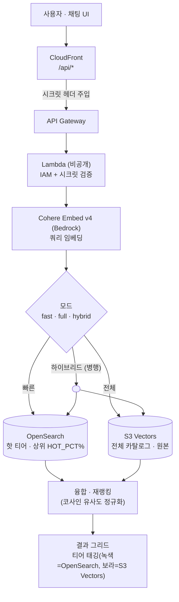

# S3 Vectors × OpenSearch — 하이브리드 이미지 검색

**시맨틱 이미지 검색**을 원클릭으로 배포할 수 있는 데모입니다. **하이브리드** 벡터 아키텍처를 사용합니다:

- **Amazon S3 Vectors** — 전체 이미지 카탈로그를 임베딩으로 저장하는 **단일 진실 원본**. 서버리스, 11-nines 내구성,
  상시 가동형 벡터 DB 대비 최대 ~90% 저렴 (*전체 검색* 티어).
- **Amazon OpenSearch Service** (관리형 도메인) — 인기 상위 일부만 담는 **핫 티어**로 저지연 k-NN 검색 (*빠른 검색* 티어).
- **Cohere Embed v4** (**Amazon Bedrock**) — 저장 이미지와 검색 쿼리를 하나의 **멀티모달·다국어** 공간에 임베딩.
  한국어/영어 텍스트→이미지 검색이 **번역 없이** 동작합니다.
- **채팅 UI** (Next.js + TypeScript) — 세 가지 모드: **빠른 검색**(OpenSearch), **전체 검색**(S3 Vectors),
  **하이브리드**(둘을 병행 조회 후 융합).

검색 백엔드는 **비공개 Lambda**입니다(퍼블릭 URL 없음). CloudFront가 `/api/*`를 API Gateway로 라우팅하고, CloudFront만
주입하는 **시크릿 헤더**를 Lambda가 검증합니다.

## 아키텍처



### Infrastructure as Code

| 계층 | 생성 주체 |
|------|-----------|
| IAM 역할, OpenSearch 도메인, Lambda, API Gateway, S3 웹 버킷, CloudFront(+OAC, 함수) | **CloudFormation** (`infra/cloudformation.yaml`) |
| S3 Vectors 버킷 + 인덱스 | `ingestion/setup_s3vectors.py` (S3 Vectors는 아직 CFN 리소스 미지원) |
| 이미지 임베딩 적재 | `ingestion/parallel_ingest.py` + `backfill_hot.py` |
| 정적 웹 빌드 + 업로드 | `web/` (Next.js static export) |

전체 과정은 **`infra/deploy.sh`** 하나로 오케스트레이션됩니다.

## 데이터 티어링: S3 Vectors(전체) + OpenSearch(핫 20%)

두 스토어는 **서로 나눠 담는 분할이 아닙니다**. 이미지는 **한 번만 임베딩**하고, 그 벡터를 양쪽에 기록합니다 —
같은 이미지를 두 번 임베딩하지 않습니다.

- **S3 Vectors = 카탈로그 100%** — 단일 진실 원본(서버리스, ~90% 저렴).
- **OpenSearch = S3 Vectors에서 복사한 인기 상위 ~`HOT_PCT`%** — 저지연 핫 티어.
  `ingestion/backfill_hot.py`가 적재 매니페스트를 읽어 **인기 상위 벡터만 골라 재임베딩 없이 복사**합니다.

OpenSearch가 핫 부분집합만 담기 때문에, 하이브리드 검색은 **"OpenSearch에 없으면 → S3 Vectors가 서빙"** 하는
폴백 개념을 자연스럽게 보여줍니다:

| 쿼리 유형 | 하이브리드 모드에서 결과 출처 |
|-----------|-------------------------------|
| 흔한/인기 | 대부분 **OpenSearch** (핫 티어, 서브초) |
| 롱테일/니치 | 대부분 **S3 Vectors** (OpenSearch에 없는 항목) |

API는 각 결과의 `tier`(`opensearch` 또는 `s3vectors`)를 반환하고 UI가 색으로 구분(녹색/보라)하므로, 폴백이 결과별로 보입니다.
융합 전에 두 엔진의 점수를 **동일한 코사인 유사도로 정규화**해 티어 간 랭킹이 공정합니다.

## 멀티리전 임베딩 (처리량)

임베딩(이미지 다운로드 → Bedrock 호출)이 가장 느리고 비싼 단계이며, 단일 리전은 그 리전의 Bedrock 처리량 쿼터에
묶입니다. 이를 넘기 위해 대량 적재기(`ingestion/parallel_ingest.py`)는 **동시 다운로드 + 배치·동시 Cohere Embed v4 호출
+ 배치 `put_vectors`** 를 수행하고, 기본적으로 **US 크로스리전 추론 프로파일** `us.cohere.embed-v4:0`
(`INGEST_EMBED_MODEL_ID`)을 사용해 여러 US 리전에 임베딩 부하를 분산합니다 — 단일 리전 쿼터를 넘기는 AWS 정식 방법입니다.

본 프로젝트 데이터로 측정한 처리량:

| 방식 | 처리량 | 851,485건 환산 |
|------|--------|----------------|
| 순차, 이미지 1장씩 | ~2.3 vec/s | ~110시간 |
| 병렬 + 배치, 단일 리전 | ~53 vec/s | ~4.5시간 |
| 병렬 + 배치, **크로스리전 프로파일** | ~75–90 vec/s | ~3시간 |

`put_vectors`와 이미지 다운로드는 병목이 **아닙니다** — 임베딩 쿼터가 병목입니다. Bedrock 쿼터를 올리거나(또는 리전별
워커로 분산) 하면 처리량이 더 올라갑니다. 멀티리전은 **벽시계 시간만** 줄이며, 임베딩 **비용은 동일**합니다(이미지당 1회 호출).

### 임베딩 방식: 실시간 병렬 vs. Batch Inference

현재 적재기는 **동기 `InvokeModel`** 에 여러 이미지를 담는 **마이크로 배치 + 병렬 호출 + 크로스리전 프로파일** 방식입니다
(Bedrock의 비동기 **Batch Inference API가 아님**). 대규모 오프라인 적재에는 Bedrock **Batch Inference**(`CreateModelInvocationJob`)
가 비용 면에서 유리할 수 있어, **향후 비교 테스트 예정**입니다.

| 구분 | 실시간 병렬 (현재) | Batch Inference API (향후 테스트) |
|------|--------------------|------------------------------------|
| 방식 | 동기 `InvokeModel` + 다중 입력 + 스레드 병렬 | S3에 JSONL 입력 → 비동기 작업 제출 → S3로 결과 |
| 지연 | 즉시(진행률 스트리밍), 결정적 | 큐 대기 + 완료 SLA 없음(벽시계 더 길거나 예측 어려움) |
| 비용 | 온디맨드 단가 | 대량 시 더 저렴할 수 있음(최대 ~50%) |
| 쿼터 | 온디맨드 TPS/쿼터에 묶임 | 배치 전용 처리 |
| 적합 | 데모/즉시성/진행 제어 | 시간 비민감 대량 오프라인 적재 |

> **TODO(데모 완료 후):** 동일 데이터셋으로 Batch Inference 버전(입력 JSONL 생성 → 작업 제출 → 결과를 S3 Vectors에 적재)을
> 구현해 실제 **비용/소요 시간**을 실시간 병렬 방식과 비교한다. (해당 임베딩 모델의 배치 추론 지원 여부 확인 필요)

## 빠른 시작

```bash
cp .env.sample .env        # 리전 / 프로젝트명 / 인스턴스 타입 등 편집
bash infra/deploy.sh       # 원클릭: 빌드, 배포, 적재, 업로드
```
완료 시 CloudFront URL이 출력됩니다. 자세한 설치는 **INSTALL.md**, 검증은 **TEST.md**를 참고하세요.

## 비용 & 정리(teardown)

관리형 OpenSearch 도메인은 시간당 과금됩니다(예: `r6g.large.search` ≈ 월 $120). CloudFront, Lambda, API Gateway,
S3 Vectors는 사용량 기반으로 저렴합니다. **끝나면 반드시 정리하세요:**

```bash
bash infra/teardown.sh
```

## 리포지토리 구조

```
infra/        CloudFormation 템플릿 + deploy.sh / teardown.sh + 랜딩 페이지
backend/      검색 Lambda (handler.py) — 쿼리 임베딩, OpenSearch + S3 Vectors 검색·융합
ingestion/    S3 Vectors 생성 + 이미지 임베딩(병렬·멀티리전) + OpenSearch 핫 복사 (+ 샘플 데이터)
web/          Next.js + TypeScript 채팅 UI (static export)
```

## 보안 참고
- 시크릿, 계정 ID, ARN, 엔드포인트를 커밋하지 않습니다. 모든 설정은 `.env`(git-ignored) 또는 배포 시 자동 탐색으로 처리됩니다.
- Lambda는 비공개(함수 URL 없음)입니다. API Gateway는 CloudFront가 주입하는 시크릿 헤더로만 접근 가능하며, 첫 배포 시 자동 생성됩니다.
- `.env`에 AWS 액세스 키를 넣지 마세요. 표준 AWS 자격증명 체인을 사용합니다.
